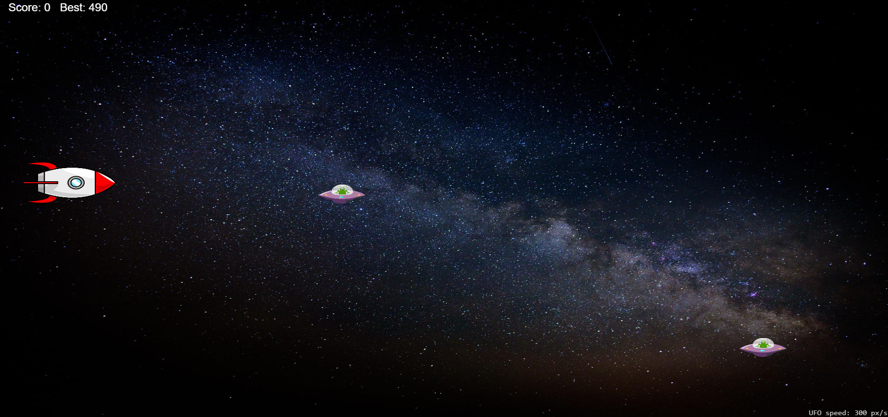

🚀 Space Battle – Rocket vs UFOs

Ein actionreiches 2D-Browsergame mit Canvas und WebAudio.
Steuere deine Rakete, schieße UFOs ab und überlebe so lange wie möglich.

🎮 Live Demo

👉 Hier spielen:
(https://ismael993-create.github.io/rocket-game/)

📸 Preview

🕹️ Steuerung

| Taste         | Funktion                |
| ------------- | ----------------------- |
| ⬆️ Arrow Up   | Rakete nach oben        |
| ⬇️ Arrow Down | Rakete nach unten       |
| SPACE         | Schießen                |
| M             | Musik an/aus            |
| [ / ]         | Lautstärke ändern       |
| V             | Volume Overlay anzeigen |

✨ Features

🚀 Spieler-Rakete mit Bewegung

👾 Dynamischer UFO-Spawn

🔫 Laser-Schusssystem mit Cooldown

💥 Partikel-Explosionen bei Treffern

📈 Schwierigkeit steigt automatisch mit der Zeit

🏆 Highscore Speicherung via LocalStorage

🎵 Dynamisch generierte Hintergrundmusik (WebAudio API)

🔊 Soundeffekte für Explosion & Game Over

🔁 Automatischer Neustart nach Game Over

🧠 Technische Umsetzung
🔧 Technologien

HTML5 Canvas

Vanilla JavaScript

WebAudio API

LocalStorage

requestAnimationFrame Game Loop

🎨 Game Mechanics

AABB Collision Detection

Zeitbasierte Bewegung (delta time)

Dynamische Geschwindigkeits-Skalierung

Objektverwaltung mit Arrays

Soft Restart ohne Page Reload

